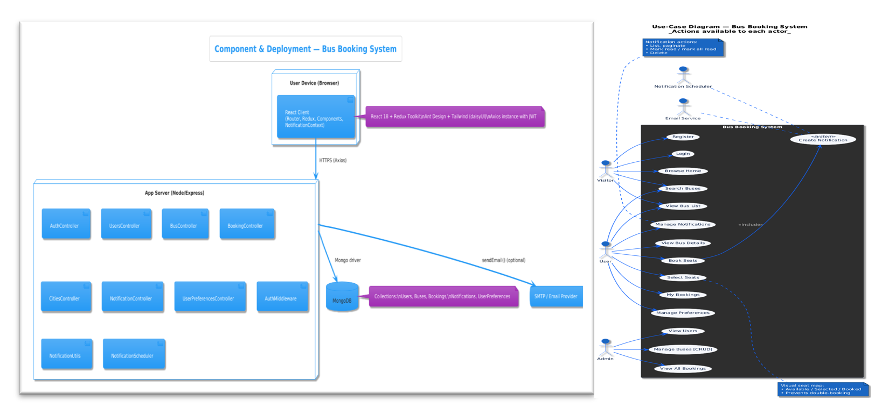
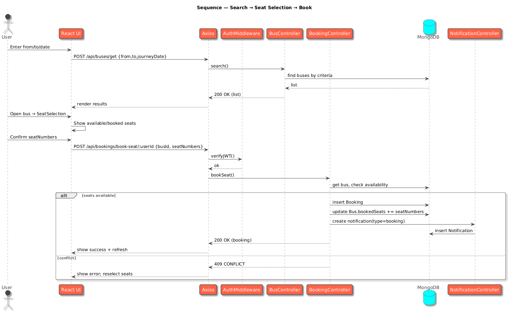
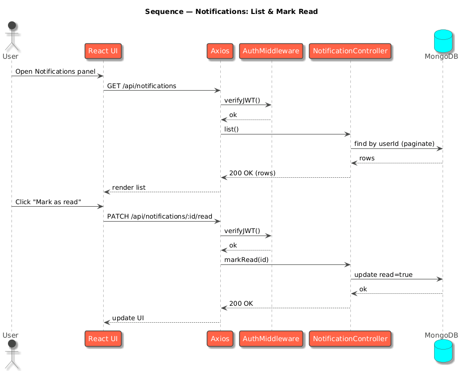
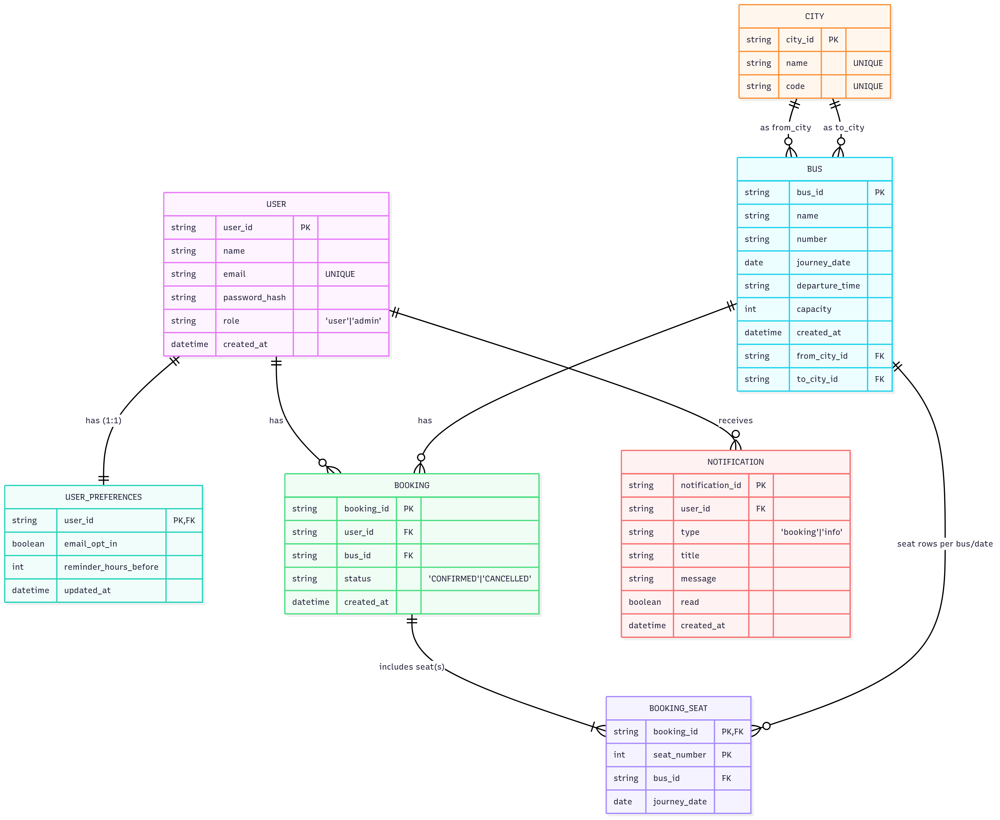
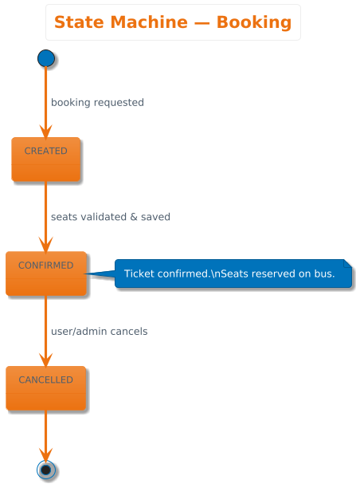
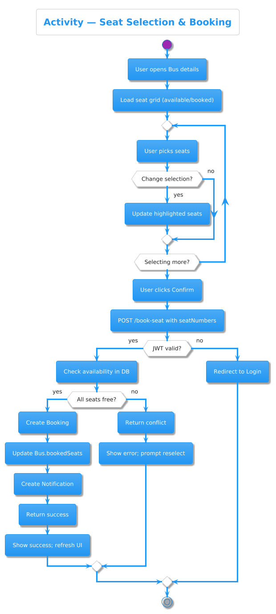
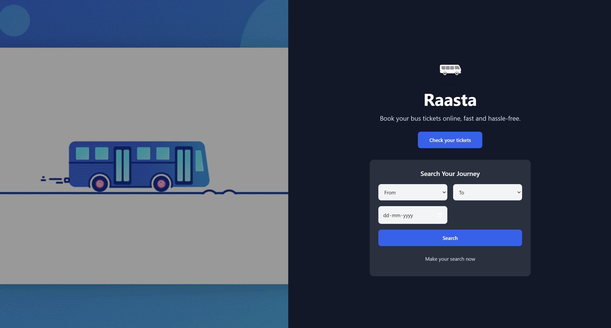
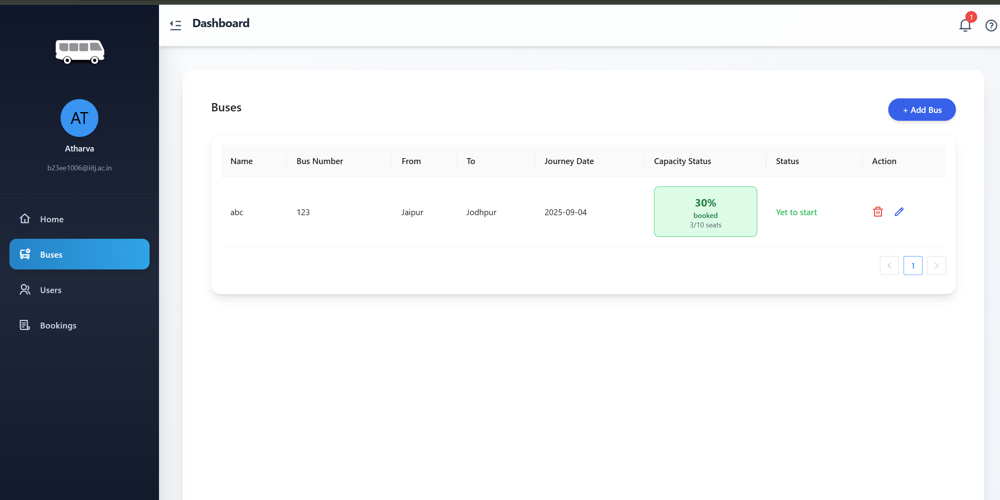
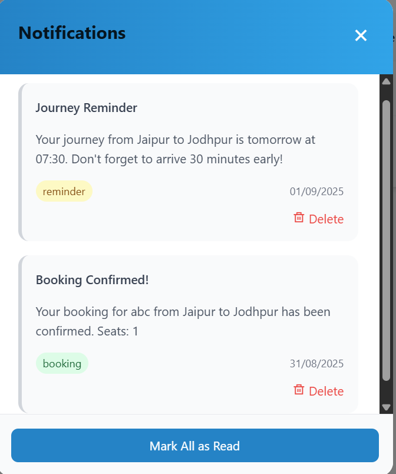
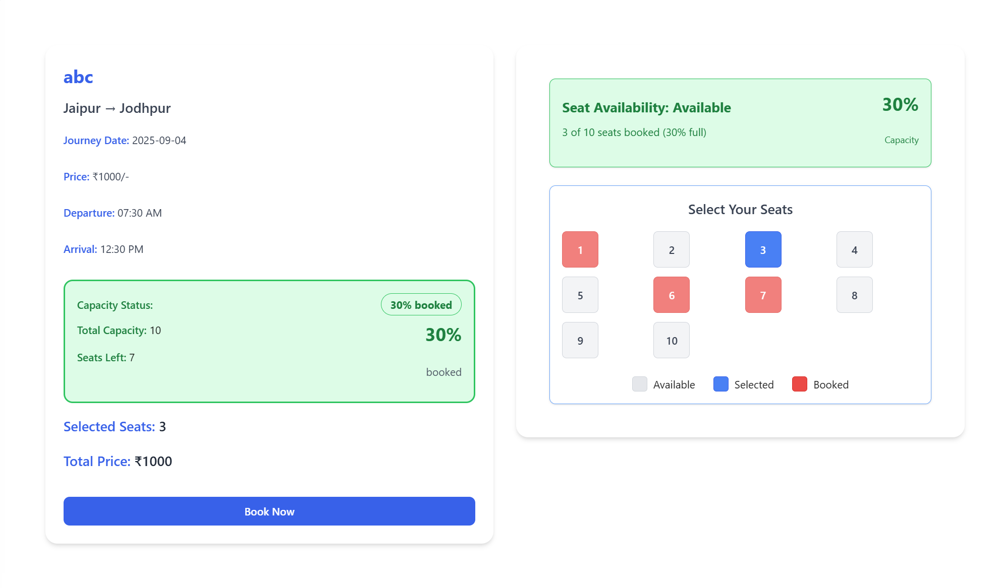

# 🚌 Bus Booking System

> **A modern, full-featured bus reservation platform built with React + Redux and Node.js + Express + MongoDB**


<div align="center">

[](https://github.com/RepoRogue123/BusBookingSystem)
[](./LICENSE)
[](https://nodejs.org)
[](https://react.dev)

</div>

---

## 📚 Table of Contents

* [About](#-about)
* [Features](#-features)
* [Tech Stack](#-tech-stack)
* [Live Demo (Video)](#-live-demo-video)
* [Getting Started](#-getting-started)

  * [Prerequisites](#prerequisites)
  * [Installation](#installation)
  * [Configuration](#configuration)
  * [Run](#run)
* [Project Structure](#-project-structure)
* [How It Works](#-how-it-works)

  * [High-Level Flow](#highlevel-flow)
  * [Data Model](#data-model)
* [API Reference (Snapshot)](#-api-reference-snapshot)
* [User Guide](#-user-guide)
* [Admin Guide](#-admin-guide)
* [Notifications & Preferences](#-notifications--preferences)
* [Styling & UX Notes](#-styling--ux-notes)
* [Troubleshooting](#-troubleshooting)
* [Future Enhancements](#-future-enhancements)
* [License](#-license)
* [Credits](#-credits)
* [Gallery](#-gallery)

---

## 🎯 About

The **Bus Booking System** is a full-stack web app to:

* **Search** buses by city pair + date
* **View** capacity at a glance (color-coded)
* **Pick seats** on an interactive seat map
* **Book** seats and see **My Bookings**
* Manage **notifications** and **preferences**
* Provide **admin** views to manage buses, users, and bookings

> This project was built as part of a MoveInSync interview assignment, with an emphasis on clear UX, modular code, and core booking flows.

---

## ✨ Features

### End-User

* 🔐 **Auth**: Register/Login with JWT; protected pages via `ProtectedRoute`
* 🔎 **Search**: From/To/Date with cities served from a curated dataset
* 🚌 **Bus List**: Route info + capacity color hints (from helper mapping)
* 💺 **Seat Selection**: Interactive visual seat map (available/selected/booked)
* ✅ **Booking**: Confirm seats and view your history in **My Bookings**
* 🔔 **Notifications**: See new booking alerts; mark read, mark all read, delete
* ⚙️ **Preferences**: Configure notification settings (opt-in, timing, etc.)

### Admin

* 🗂️ **Buses**: Add/Update/Delete bus routes and capacity
* 🙍 **Users**: View all users
* 📒 **Bookings**: View all system bookings
* 🔒 **RBAC**: Admin-only routes guarded on both client and server

> **Not included (yet):** payments, analytics dashboards, revenue tracking, real-time seat locks, mobile apps. These are listed under **Future Enhancements**.

---

## 🧰 Tech Stack

**Frontend**

* React 18, React Router
* Redux Toolkit
* Ant Design + Tailwind CSS (via DaisyUI)
* Axios (centralized instance with token injection)

**Backend**

* Node.js + Express
* MongoDB + Mongoose
* JWT Auth + middleware
* Nodemailer hooks ready (optional emails)
* Notification utilities & (optional) scheduler

> **Note:** Emails are optional; enable via `.env` and `notificationUtils.js`.

---

## 🎥 Live Demo (Video)


*Placeholder — add your 3–4 min YouTube/Vimeo link here with a thumbnail*

---

## 🚀 Getting Started

### Prerequisites

* Node.js **18+** and npm
* MongoDB (local or Atlas)
* Git (to clone)

### Installation

```bash
# 1) Clone
git clone https://github.com/RepoRogue123/BusBookingSystem.git
cd BusBookingSystem

# 2) Install deps
cd server && npm install
cd ../client && npm install
```

### Configuration

Create `server/.env`:

```env
# Server
PORT=5000
mongo_url=mongodb://localhost:27017/bus-booking
jwt_secret=change-this-in-production

# Optional email (used by notification utils)
EMAIL=your-email@example.com
PASSWORD=your-app-password
```

> Using Gmail? Generate an **App Password** and use that in `PASSWORD`.
> With MongoDB Atlas, replace `mongo_url` with your connection string.

*(Optional)* `client/.env`:

```env
REACT_APP_API_BASE=http://localhost:5000
```

### Run

Use **two terminals**:

```bash
# Terminal A (API)
cd server
npm start

# Terminal B (Client)
cd client
npm start
```

* Client: [http://localhost:3000](http://localhost:3000)
* API:    [http://localhost:5000](http://localhost:5000)

---

## 📁 Project Structure

```
reporogue123-busbookingsystem/
├── client/
│   ├── public/
│   └── src/
│       ├── components/
│       │   ├── Bus.js
│       │   ├── BusForm.js
│       │   ├── DefaultLayout.js
│       │   ├── Loader.js
│       │   ├── NotificationSettings.jsx
│       │   ├── PageTitle.js
│       │   ├── ProtectedRoute.js
│       │   ├── PublicRoute.js
│       │   └── SeatSelection.js
│       ├── contexts/
│       │   └── NotificationContext.js
│       ├── helpers/
│       │   ├── axiosInstance.js
│       │   └── capacityColors.js
│       ├── pages/
│       │   ├── Bookings.jsx
│       │   ├── BookNow.jsx
│       │   ├── Home.jsx
│       │   ├── Index.jsx
│       │   ├── Login.jsx
│       │   ├── Register.jsx
│       │   └── Admin/
│       │       ├── AdminBookings.jsx
│       │       ├── AdminBuses.jsx
│       │       └── AdminUsers.jsx
│       └── redux/
│           ├── alertsSlice.js
│           ├── store.js
│           └── usersSlice.js
└── server/
    ├── server.js
    ├── config/
    │   └── dbConfig.js
    ├── Controllers/
    │   ├── authController.js
    │   ├── bookingController.js
    │   ├── busController.js
    │   ├── citiesController.js
    │   ├── notificationController.js
    │   ├── userPreferencesController.js
    │   └── usersController.js
    ├── data/
    │   └── cities.json
    ├── middlewares/
    │   └── authMiddleware.js
    ├── models/
    │   ├── bookingsModel.js
    │   ├── busModel.js
    │   ├── notificationModel.js
    │   ├── userPreferencesModel.js
    │   └── usersModel.js
    ├── routes/
    │   ├── authRoutes.js
    │   ├── bookingsRoutes.js
    │   ├── busesRoutes.js
    │   ├── citiesRoutes.js
    │   ├── notificationRoutes.js
    │   ├── userPreferencesRoutes.js
    │   └── usersRoutes.js
    └── utils/
        ├── notificationScheduler.js
        └── notificationUtils.js
```


*Component & deployment overview: Client ↔ API ↔ MongoDB, plus Notifications flow*

---

## 🧠 How It Works

### High-Level Flow


*Sequence for a user booking seats*



*Sequence for creating and fetching notifications*

1. **Client** (React + Redux) handles routing, state, and UI.
2. **Axios instance** injects JWT from localStorage into `Authorization` headers.
3. **API** (Express) validates JWT via `authMiddleware`, then delegates to controllers.
4. **MongoDB** (Mongoose models) persists users, buses, bookings, notifications, prefs.
5. **Notifications**: created on events (e.g., booking), fetched by client; preferences control behavior. Optional email hooks are available.

### Data Model


*Entity-Relationship diagram: User ↔ Booking ↔ Bus; User ↔ Notification; User ↔ Preferences*



*States for a booking: created → confirmed → canceled*



*Activities through the booking process*

**Core entities (simplified):**

* **User**: name, email, passwordHash, role/isAdmin, createdAt
* **Bus**: name/number, from, to, journeyDate, departureTime, capacity, bookedSeats\[]
* **Booking**: userId, busId, seatNumbers\[], status, createdAt
* **Notification**: userId, type (`booking`, `info`), title, message, read, createdAt
* **UserPreferences**: userId, emailOptIn, reminderHoursBefore, etc.
* **City**: served by `cities.json` via `citiesRoutes.js`

---

## 📎 API Reference (Snapshot)

**Base URL**: `/api`

### Auth

| Method | Path                | Description | Body                        |
| -----: | ------------------- | ----------- | --------------------------- |
|   POST | `/auth/create-user` | Register    | `{ name, email, password }` |
|   POST | `/auth/login`       | Login → JWT | `{ email, password }`       |

### Users

| Method | Path                   | Description            | Auth |
| -----: | ---------------------- | ---------------------- | ---- |
|    GET | `/users/get-all-users` | List all users (admin) | JWT  |
|    GET | `/users/:userId`       | Get single user        | JWT  |

### Cities

| Method | Path                     | Description     |
| -----: | ------------------------ | --------------- |
|    GET | `/cities/get-all-cities` | List all cities |

### Buses

| Method | Path                   | Description                   | Auth |
| -----: | ---------------------- | ----------------------------- | ---- |
|   POST | `/buses/add-bus`       | Create bus (admin)            | JWT  |
|   POST | `/buses/get-all-buses` | List buses (filterable)       | —    |
|    GET | `/buses/:id`           | Get bus by id                 | —    |
|    PUT | `/buses/:id`           | Update bus (admin)            | JWT  |
| DELETE | `/buses/:id`           | Delete bus (admin)            | JWT  |
|   POST | `/buses/get`           | Search by from/to/journeyDate | —    |

**Search example**

```json
POST /api/buses/get
{
  "from": "Bengaluru",
  "to": "Hyderabad",
  "journeyDate": "2025-09-04"
}
```

### Bookings

| Method | Path                                     | Description               | Auth |
| -----: | ---------------------------------------- | ------------------------- | ---- |
|   POST | `/bookings/book-seat/:userId`            | Create booking            | JWT  |
|    GET | `/bookings/get-all-bookings`             | List all bookings (admin) | JWT  |
|    GET | `/bookings/:user_Id`                     | List bookings for a user  | JWT  |
| DELETE | `/bookings/:booking_id/:user_id/:bus_id` | Cancel booking            | JWT  |

### Notifications

| Method | Path                                  | Description            | Auth |
| -----: | ------------------------------------- | ---------------------- | ---- |
|    GET | `/notifications`                      | List (with pagination) | JWT  |
|    GET | `/notifications/unread-count`         | Unread count           | JWT  |
|  PATCH | `/notifications/:notificationId/read` | Mark one as read       | JWT  |
|  PATCH | `/notifications/mark-all-read`        | Mark all as read       | JWT  |
| DELETE | `/notifications/:notificationId`      | Delete                 | JWT  |

### User Preferences

| Method | Path                | Description                       | Auth |
| -----: | ------------------- | --------------------------------- | ---- |
|    GET | `/user-preferences` | Get current user’s preferences    | JWT  |
|    PUT | `/user-preferences` | Update current user’s preferences | JWT  |

> **Auth header:** `Authorization: Bearer <token>`

---

## 👤 User Guide


*Placeholder — add dashboard screenshot*

**1) Register/Login**

* Create an account, then sign in. Auth-guarded pages require JWT.

**2) Search Buses**

* Choose **From**, **To**, **Date** → **Search**.
* Results show per-bus capacity with color hints (config in `capacityColors.js`).

**3) Book Seats**

* Open a bus → **Book Now** → **Seat Selection**.
* Pick available seats (available/selected/booked legend visible).
* Confirm booking and view it under **My Bookings**.

**4) Manage Bookings**

* Go to **Bookings** to see upcoming/past trips.
* Use **Cancel** (if enabled by route/rules).

**5) Notifications**

* Click the **bell** in the header (DefaultLayout).
* Mark single/all as read, delete items, and open **Preferences**.

---

## 👨‍💼 Admin Guide


*Placeholder — add Admin Buses/Bookings/Users screenshots*

**AdminBuses**

* Add/update/delete buses: set route, date, time, capacity, etc.

**AdminBookings**

* View all bookings across users; useful for support operations.

**AdminUsers**

* View users; manage roles or status if needed.

**Access Control**

* Admin views require admin JWT; guarded by `ProtectedRoute` and `authMiddleware`.

---

## 🔔 Notifications & Preferences



* **Creation:** Server creates notifications on events (e.g., booking confirmed).
* **Fetching:** Client fetches periodically (polling) and on user actions.
* **UI:** Notification list with pagination; actions: mark read, mark all read, delete.
* **Preferences:** Configure delivery preferences in `NotificationSettings.jsx`.
* **Email (optional):** Enable via `.env` and `notificationUtils.js`.

---

## 🎨 Styling & UX Notes

* **Ant Design** components for tables, forms, modals.
* **Tailwind + DaisyUI** for quick, consistent styling.
* **Capacity coloring** via `helpers/capacityColors.js` (tweak thresholds/colors there).
* **Layout** via `DefaultLayout` (header with bell, consistent page title, loader).
* **State** via Redux Toolkit (`usersSlice`, `alertsSlice`); notifications via Context.

> 
> *Seat selection screenshot with legend*

---

## 🧩 Troubleshooting

**Server won’t start**

* Check `server/.env`, especially `mongo_url` and `jwt_secret`
* Verify MongoDB is up (local service or Atlas IP whitelist)
* Re-install deps: `rm -rf server/node_modules && npm install`

**Client won’t start**

* Install deps in `client/`
* Ensure API is running on `PORT=5000`
* If you changed ports, set `REACT_APP_API_BASE`

**401/403 on protected routes**

* You need `Authorization: Bearer <token>`
* Ensure token exists in localStorage and hasn’t expired

**Seats appear already booked**

* Another user may have booked them; refresh bus details
* Confirm server updates `bookedSeats` after booking

**Notifications don’t appear**

* Create a booking to trigger one
* Open bell menu to refresh
* If using email, verify `EMAIL/PASSWORD` and provider settings

---

## 🗺️ Future Enhancements

* 💳 Payments & invoices (Stripe/Razorpay)
* 🔄 Real-time seat updates (WebSockets/SSE)
* 📈 Admin analytics dashboard
* 📱 React Native mobile apps
* 🗺️ Route map & stops visualization
* 📧 SMS/Email campaigns & templates
* 🧪 End-to-end tests (Playwright/Cypress)
* 🐳 Docker Compose for one-command dev

---

## 📜 License

This project is released under the **MIT License** — see [LICENSE](./LICENSE).

---

## 🙌 Credits

* **Author:** Atharva Honparkhe (RepoRogue123)
* UI: Ant Design, Tailwind, DaisyUI
* Backend: Express, Mongoose

---

## 📸 Gallery

> Replace placeholders with real screenshots from your running app.

* **Homepage (Search)**
  

* **Seat Selection**
  

* **Notifications & Preferences**
  
  

* **Admin: Buses / Bookings / Users**
  

---

### Maintainer Notes (remove before publishing)

* Keep API tables in sync with `server/routes/`.
* If you enable email, add a short “Email Setup” section.
* Add your **demo video link** near the top once recorded.
